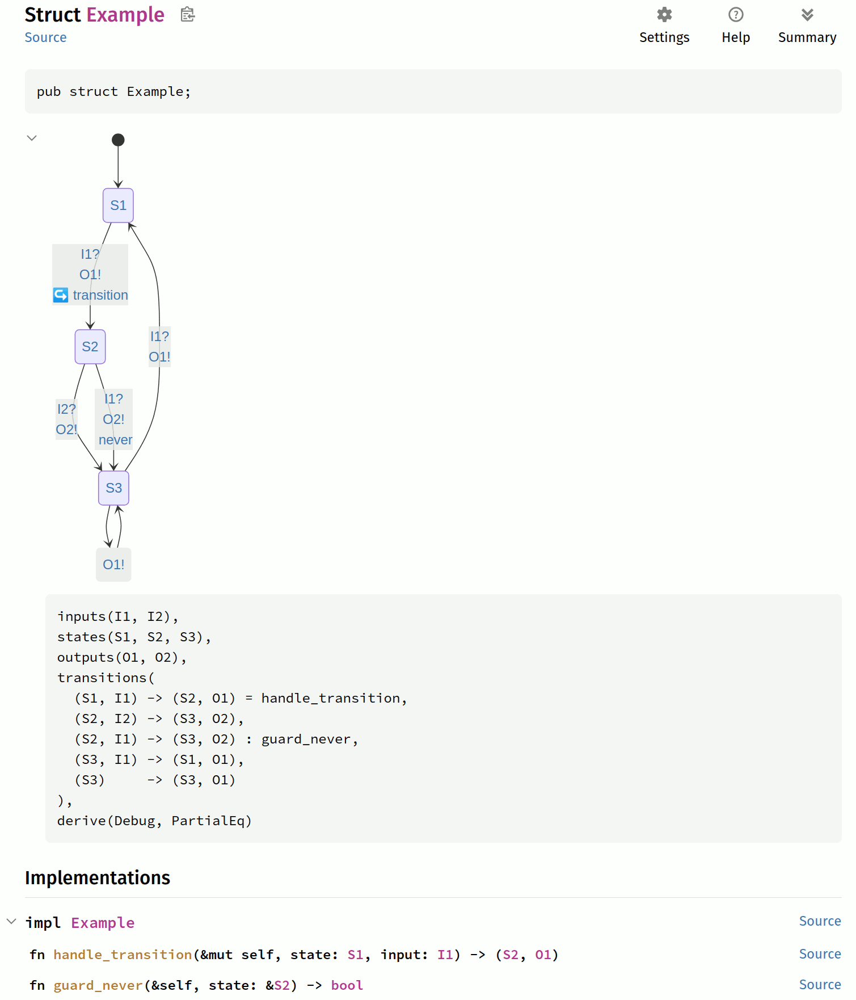

# A domain-specific language for building finite automata in Rust

[![Documentation][docs-badge]][docs-link]
[![Latest Version][crate-badge]][crate-link]

The `rust-automata` crate provides a simple DSL for building finite state machines in Rust with minimum effort, using proc macros from the `rust-automata-macros` crate.

The `rust-automata` directly implement [Mealy machines](https://en.wikipedia.org/wiki/Mealy_machine):

A Mealy machine is a tuple `(S, s0, Σ, Λ, T)` consisting of the following:

- a finite set of states `S` the machine can be in,
- an initial state `s0` which is an element of `S`,
- a finite set called the input alphabet `Σ` the machine can receive,
- a finite set called the output alphabet `Λ` the machine can output,
- a transition function `T : S × Σ → S × Λ` mapping pairs of a state and an input symbol to the corresponding next state and output symbol.

Additionally:
- The machine itself, each state, input and output symbol can be annotated with **arbitrary data**.
- Each transition can have an **optional handler** that is called when the transition is taken. 
  Only the handler can mutate the data -- the state data **cannot be mutated outside the handler** by design. 
  This is done by using the "type state" pattern. Each state/input/output struct is wrapped by an internal enum that is automatically generated by the macro.
- Each transition can have an optional **guard** (a predicate function).
- The input or output can be missing (e.g. for a Moore machine). This is internally implemented by a special `Nothing` symbol.

## [Examples](https://github.com/michalsustr/rust-automata/tree/main/examples)

See [examples](https://github.com/michalsustr/rust-automata/tree/main/examples) for more examples.

Here is a simple example to give a quick taste:

```rust
mod example {
use rust_automata::*;

#[state_machine(
    inputs(I1, I2),
    states(S1, S2, S3),
    outputs(O1, O2),
    transitions(
        (S1, I1) -> (S2, O1) = handle_transition,
        (S2, I2) -> (S3, O2),
        (S2, I1) -> (S3, O2) : guard_never,
        (S3, I1) -> (S1, O1),
        (S3) -> (S3, O1),
    ),
    generate_structs(true),
    derive(Debug, PartialEq),
)]
pub struct Example;

impl Example {
  fn handle_transition(&mut self, state: S1, input: I1) -> (S2, O1) { 
    println!("handle_transition called");
    (S2, O1) 
  }
  fn guard_never(&self, state: &S2) -> bool { false }
}

}

use example::*;
use rust_automata::*;

// Create a new state machine.
let mut m = StateMachine::new(Example, S1);

// Relay an input. Prints "handle_transition called".
let output: O1 = m.relay(I1);
assert!(m.state().is_s2());

// Consume an input.
assert!(!m.can_consume::<I1>());  // Can't consume because of the guard.
assert!(m.can_consume::<I2>());
m.consume(I2);
assert!(m.state().is_s3());

// Produce an output, no input is needed.
let output: O1 = m.produce();
assert!(m.state().is_s3());

// Cycle in the absorbing state.
m.step();
m.step();
m.step();
assert!(m.state().is_s3());
```

This is how the example looks like in the docs:



## Why would you want to use this crate?

- You're looking for a simple way to specify and implement finite state machines that can have arbitrary data in states, inputs and outputs.
- You want to make sure your implementation and model specification match.

## When you should not use this crate?

- Your state/input/output space is very large.
- You need to model non-deterministic machines.

## Roadmap

This crate is still under active development. Expect breaking changes. 

Here are some of the things that are planned.

Major:
- [ ] Export to [UPPAAL](https://www.uppaal.org/) format.
- [ ] Expand to support [timed automata](https://en.wikipedia.org/wiki/Timed_automaton).
- [ ] Add support for capturing traces of the machine and replaying them.

Minor (soon):
- [x] Guards as bool expressions
- [ ] Performance improvements
- [ ] Logging transitions -- tracing?
- [ ] Configurable `should_panic` for invalid transitions  
- [ ] Better error messages
  - sig checks for guards

## Contributions are welcome!

If you have any suggestions, please open an issue or a PR.
Also, I'd be happy if you star the repo!

- [ ] More examples!
- [ ] An example of Paxos protocol implementation.
- [ ] Nicer error messages when the DSL is mis-specified.
- [ ] Export to [PRISM](https://www.prismmodelchecker.org/) format.

## Feature flags

- `mermaid` - generate Mermaid state diagrams in the doc strings. 
- `dsl` (default) - re-export the DSL into doc strings.

## Without DSL

To see an example of a state machine without DSL (useful for debugging), install `cargo-expand` and run:

```bash
cd examples
cargo expand lock  # Or any other example.
```

## Acknowledgements

- Initially based on the [`rust-fsm`](https://github.com/eugene-babichenko/rust-fsm) crate.
- Working around matching on one mutable struct based on [`takeable`](https://github.com/kyp44/takeable) repo.
- [Model-Based Testing Applied to Software Components of Satellite Simulators](https://www.researchgate.net/journal/Modelling-and-Simulation-in-Engineering-1687-5605/publication/329621404_Model-Based_Testing_Applied_to_Software_Components_of_Satellite_Simulators/links/6183f59b0be8ec17a96e686e/Model-Based-Testing-Applied-to-Software-Components-of-Satellite-Simulators.pdf?_tp=eyJjb250ZXh0Ijp7ImZpcnN0UGFnZSI6Il9kaXJlY3QiLCJwYWdlIjoicHVibGljYXRpb25Eb3dubG9hZCIsInByZXZpb3VzUGFnZSI6InB1YmxpY2F0aW9uIn19) -- This project is trying to automatically implement step 1 of this paper.
- [Hoverbear's blog post on the state machine pattern](https://hoverbear.org/blog/rust-state-machine-pattern/) -- usage of the "type state" pattern.

[repo]: https://github.com/michalsustr/rust-automata
[docs-badge]: https://docs.rs/rust-automata/badge.svg
[docs-link]: https://docs.rs/rust-automata
[crate-badge]: https://img.shields.io/crates/v/rust-automata.svg
[crate-link]: https://crates.io/crates/rust-automata
